# 🎓 Final Year Project — College Placement Portal

## 📘 Project Description

This is a comprehensive AI-powered Placement Portal developed as a final-year project for our college REVA UNIVERSITY. It is designed to streamline and digitize the end-to-end campus recruitment process for students, companies, and college administrators.

The portal offers three types of logins:

    👨‍🎓 Student Login
    🏢 Company Login
    🛠️ Admin Login

## 🧭 How It Works

1. Admin Module
    Admin verifies and manages student and company registrations.
    Can view all posted drives and student applications.
    Manages placement statistics and oversees the platform.

2. Company Module
    Companies register and log in to the portal.
    Post job drives with relevant details like eligibility, job description, CTC, location, etc.
    View applicants and download student profiles/resumes.

3. Student Module
    Students register and create detailed profiles.
    Browse available job drives posted by companies.
    Apply to drives if they meet eligibility criteria.
    Can generate AI-enhanced resumes through the integrated Resume Generator tool.
    Participate in AI-powered mock interviews to enhance preparation.

## 🤖 AI-Powered Features

    AI Resume Generator : Students can generate smart, professional resumes using AI by providing key details.
    Mock Interview Module : Offers students an interactive AI-based mock interview experience for better readiness.

## 🧪 Tech Stack

    Frontend: React, Vite, Next, Tailwind CSS
    Backend: Node.js, Express.js
    Database: MongoDB
    Authentication: Clerk, Firebase Auth
    AI Integration: Gemini API
    Other Tools: EmailJS, jsPDF, html2canvas

## 🚀 Live Ports & Running Instructions
| Module                    | Localhost Port   | Start Command |
| ------------------------- | ---------------- | ------------- |
| **Frontend**              | `localhost:3001` | `npm start`   |
| **Backend**               | `localhost:5000` | `npm start`   |
| **AI Mock Interview**     | `localhost:5173` | `npm run dev` |
| **Resume Generator (AI)** | `localhost:3000` | `npm run dev` |
⚠️ Note: Please start the Resume Generator before running the other modules to avoid errors.

## 🔐 Environment Files Setup
Replace all ENTER_HERE values with your actual credentials or keys.

### ✅ Backend .env

MONGODB_URI=mongodb://127.0.0.1:27017/placementPortal
JWT_SECRET=ENTER_YOUR_JWT_SECRET_HERE
PORT=5000
EMAIL_USER=ENTER_YOUR_EMAIL_HERE
EMAIL_PASSWORD=ENTER_YOUR_EMAIL_PASSWORD_HERE
CLIENT_URL=http://localhost:3001

### ✅ Frontend .env

REACT_APP_GEMINI_API_KEY=ENTER_YOUR_GEMINI_API_KEY_HERE

### ✅ AI Mock Interview .env

VITE_CLERK_PUBLISHABLE_KEY=ENTER_YOUR_CLERK_PUBLISHABLE_KEY_HERE
VITE_FIREBASE_AUTH_DOMAIN=ENTER_YOUR_FIREBASE_AUTH_DOMAIN_HERE
VITE_FIREBASE_PROJECT_ID=ENTER_YOUR_FIREBASE_PROJECT_ID_HERE
VITE_FIREBASE_STORAGE_BUCKET=ENTER_YOUR_FIREBASE_STORAGE_BUCKET_HERE
VITE_FIREBASE_MESSAGING_SENDER_ID=ENTER_YOUR_MESSAGING_SENDER_ID_HERE
VITE_FIREBASE_APP_ID=ENTER_YOUR_FIREBASE_APP_ID_HERE
CLERK_SECRET_KEY=ENTER_YOUR_CLERK_SECRET_KEY_HERE
VITE_GEMINI_API_KEY=ENTER_YOUR_GEMINI_API_KEY_HERE

### ✅ Resume Generator .env.local

NEXT_PUBLIC_CLERK_PUBLISHABLE_KEY=ENTER_YOUR_CLERK_PUBLISHABLE_KEY_HERE
CLERK_SECRET_KEY=ENTER_YOUR_CLERK_SECRET_KEY_HERE

NEXT_PUBLIC_CLERK_SIGN_IN_URL=/sign-in
NEXT_PUBLIC_CLERK_SIGN_UP_URL=/sign-up

MONGODB_URL=mongodb://127.0.0.1:27017/placementPortal
GEMINI_API_KEY=ENTER_YOUR_GEMINI_API_KEY_HERE

BASE_URL=http://localhost:3000

## 📸 Screenshots

### Home Page
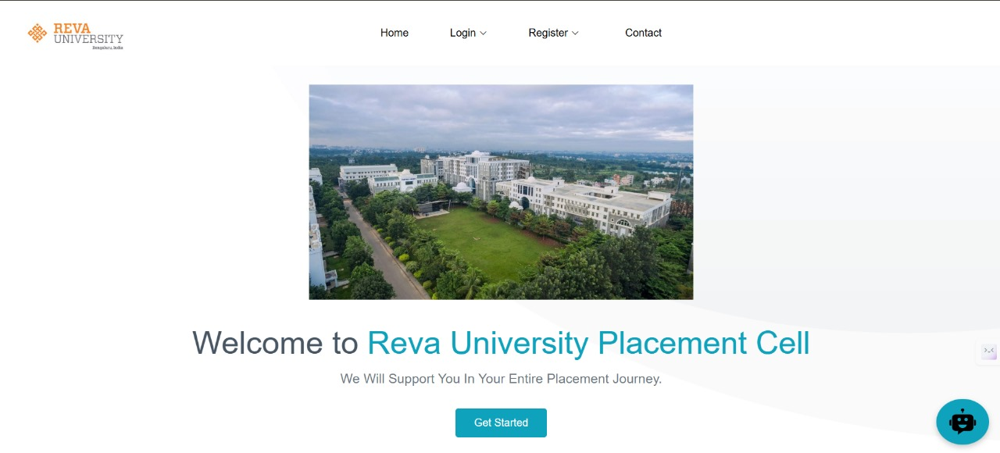

### ChatBot
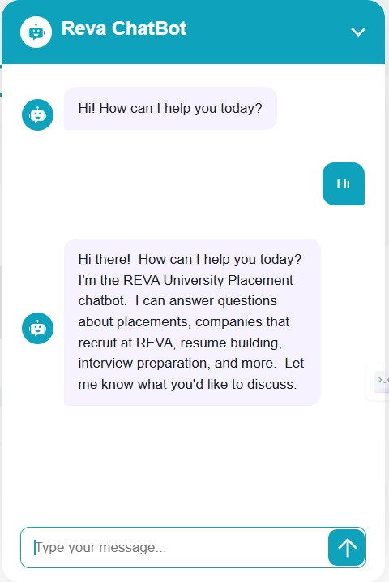

### Login Page
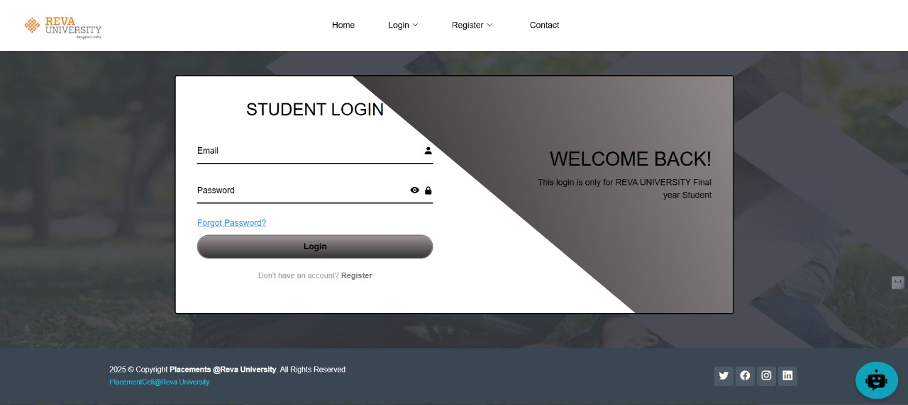

### Student Applications
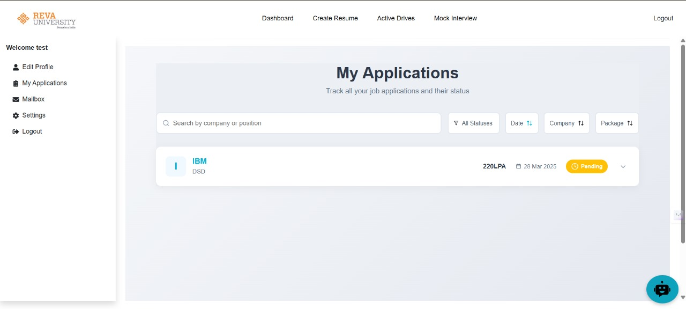

### Mail
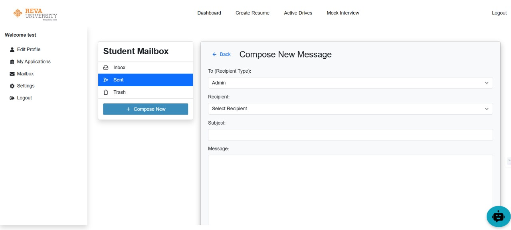

### AI Mock Interview Starting Page
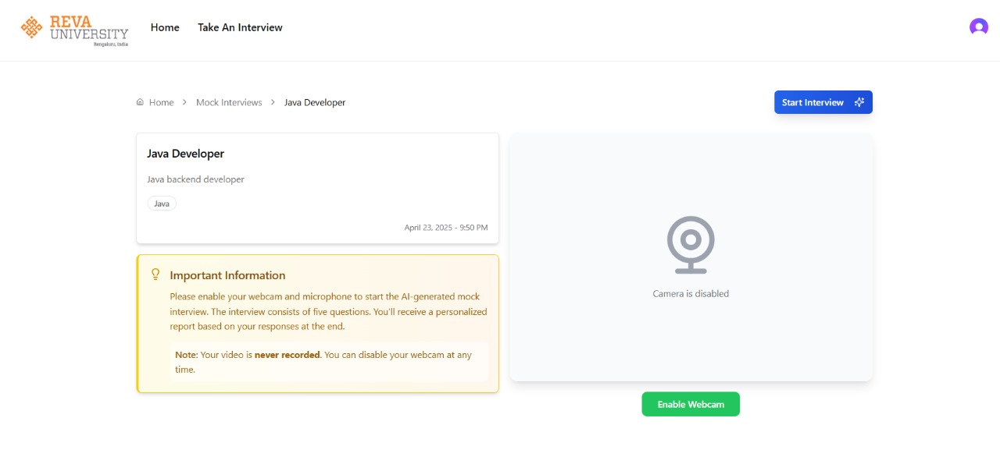

### Ai Mock Interview Feedback
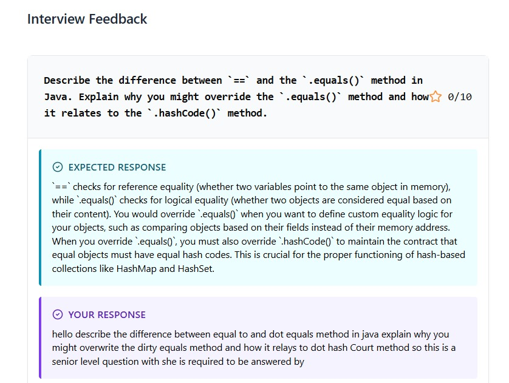

### AI Resume Generator
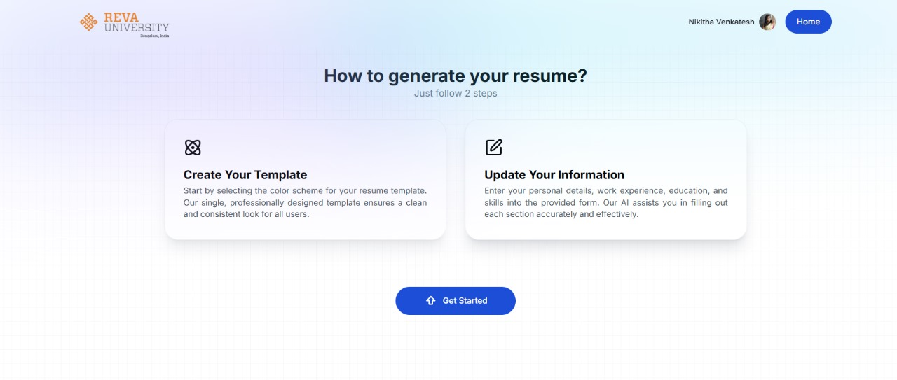

### AI Resume Generator Dashboard
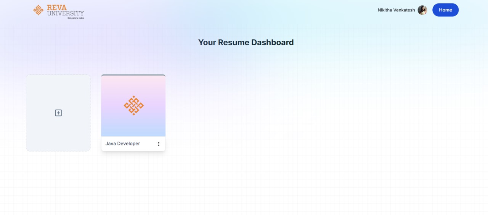

### Preview of AI Resume Generator
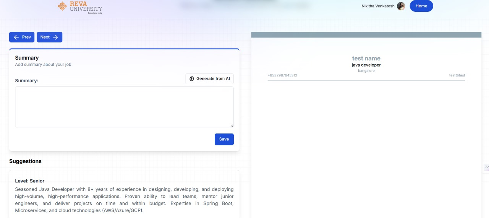

### AI Resume Generator Suggestions Page
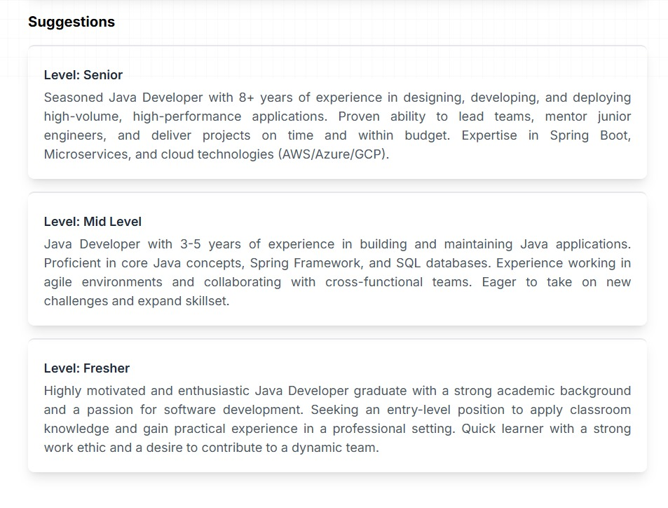

